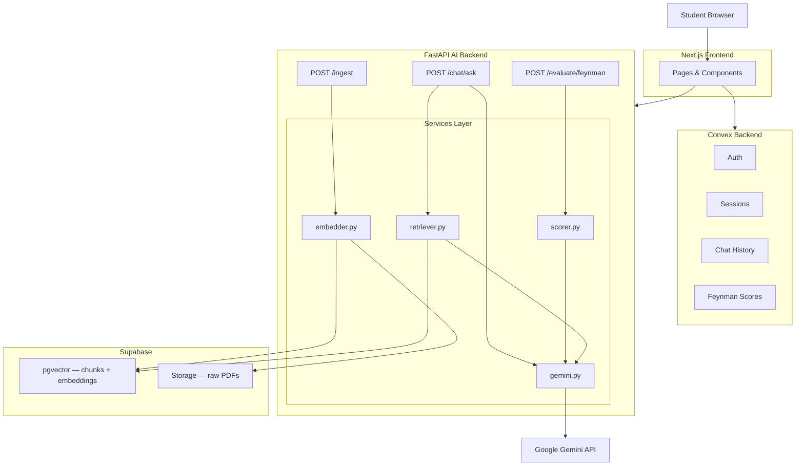

# ARCHITECTURE — Sensei

**Version:** 1.0
**Last Updated:** 2026-06-10

---

## 1. Overview

Sensei uses a split-backend architecture. The AI pipeline lives in a standalone FastAPI service (Python) to keep AI logic isolated, testable, and swappable. All auth, session metadata, and chat history are managed by Convex, which provides real-time sync to the frontend out of the box. Supabase handles file storage and vector embeddings via pgvector. The frontend is Next.js, communicating with both Convex (for data) and FastAPI (for AI operations).

This design follows the Single Responsibility Principle at the infrastructure level: no service does more than one job.

---

## 2. System Diagram



---

## 3. Components

### Next.js Frontend
- **Purpose:** UI layer — chat interface, session management, Feynman mode, history
- **Key pages:** `/` (landing), `/dashboard`, `/session/[id]`, `/settings`
- **Framework:** Next.js (App Router)
- **Key responsibilities:**
  - Render chat UI with real-time updates via Convex subscriptions
  - Send AI requests to FastAPI with Convex session token in headers
  - Display Feynman scoring results
  - Handle file uploads before sending to FastAPI ingest route

### FastAPI AI Backend
- **Purpose:** All AI operations — ingestion, retrieval, Gemini calls, Feynman scoring
- **Key routes:** `POST /ingest/upload`, `POST /chat/ask`, `POST /evaluate/feynman`
- **Framework:** FastAPI (Python 3.11+)
- **Key responsibilities:**
  - Validate all incoming requests via Pydantic models
  - Verify Convex session tokens on every request
  - Enforce role integrity via a role-locked system prompt + the per-message scope gate (no keyword blocklist — ADR-0008)
  - Rate limit per user per minute
  - Orchestrate RAG pipeline
  - Call Gemini using the student's own key (BYOK) or the platform Default Key, enforcing the Daily Allowance on the latter

### Convex
- **Purpose:** Auth, session metadata, chat history, Feynman score records
- **Key tables:** `users`, `sessions`, `documents`, `messages`, `feynmanScores`
- **Key responsibilities:**
  - Authenticate users (email/password or OAuth)
  - Store and sync session scope, status, timestamps
  - Store full chat history per session
  - Persist Feynman evaluation results
  - Provide real-time subscriptions to the frontend

### Supabase
- **Purpose:** Vector storage (pgvector) and raw file storage
- **Key tables:** `chunks` (with embedding column)
- **Key responsibilities:**
  - Store document chunks with their vector embeddings
  - Run cosine similarity search via pgvector
  - Store raw PDF files
  - Enforce RLS so users only access their own chunks

---

## 4. Key Data Flows

### 1. Document Upload & Ingestion
```text
Student uploads PDF in UI
→ Frontend sends file to POST /ingest/upload (with Convex token + session_id)
→ FastAPI validates token, file size (≤5MB), session storage (≤20MB), chunk cap — rejects early if invalid
→ FastAPI creates a Convex documents row (status "processing"), stores the raw PDF in Supabase Storage
→ FastAPI returns { status: "processing", document_id } and starts background processing
→ [background] embedder.py extracts text → splits into chunks (500 words, 50 overlap — within gemini-embedding-001's 2048-token input limit) → batch-embeds via gemini-embedding-001 (1536-dim) → stores chunks + embeddings in Supabase (scoped to user_id + session_id)
→ [background] success: set documents.status "ready" (+ chunkCount); failure: status "failed" (+ error), delete any partial chunks
→ Frontend (subscribed to the Convex documents row) sees status flip to ready/failed in real time
```

### 2. Student Asks a Question
```text
Student types question in chat UI
→ Frontend sends POST /chat/ask (question, session_id, Convex token) — no conversation_history (ADR-0010)
→ FastAPI validates token
→ FastAPI start mutation (Convex): velocity check-and-consume (20/min fixed window — ADR-0001) + returns key material (BYOK blob present → use it; absent → Default Key), session scope/status, and the last N messages (server-read history — ADR-0010)
  → velocity exceeded? reject (429 RATE_LIMITED). Session expired? reject (SESSION_EXPIRED)
→ FastAPI checks scope: embed question (gemini-embedding-001, 1536-dim) → cosine similarity vs the anchor (ADR-0004). No fixed threshold separates either mode — both use a band + judge (ADR-0004 amendment):
  → doc session: top-1 chunk similarity → ≥0.66 in, ≤0.59 out, borderline 0.59–0.66 → un-metered LLM scope-judge (label + top chunks)
  → doc-less session: similarity vs description → ≥0.63 in, ≤0.57 out, borderline 0.57–0.63 → un-metered LLM scope-judge (label + description)
  → judge = gemini-3.1-flash-lite, no allowance; clear-in/clear-out decided in code with no Gemini call
  → out of scope? increment outOfScopeCount, persist the user message + templated redirect, return redirect (no allowance, no answer-generation call)
  → 3rd consecutive out-of-scope? return prompt to create new session
→ in scope: reset outOfScopeCount; retriever.py reuses the question embedding → similarity search in Supabase (scoped to session)
  → chunks found? build RAG prompt
  → no chunks? build general knowledge prompt
→ Default Key? allowance check-and-increment (Convex, race-free — ADR-0001) — exhausted? return "add your key" prompt. BYOK → allowance not checked
→ gemini.py builds structured prompt (system + server-read history + context + question)
→ gemini.py calls Gemini API using the selected key
→ FastAPI persists the turn to Convex (user message + assistant message with server-computed responseType/source + bumps lastActivityAt — ADR-0010); on Gemini failure, refund the allowance (ADR-0001) and store no assistant message
→ FastAPI returns answer to frontend (optimistic render); canonical record arrives via the Convex subscription
```

### 3. Feynman Evaluation
```text
Student clicks "Test Me"
→ Sensei asks which concept to explain
→ Student picks concept + submits explanation
→ Frontend sends POST /evaluate/feynman (concept, explanation, session_id, Convex token)
→ FastAPI validates token
→ retriever.py pulls relevant chunks for the concept from session
→ scorer.py builds evaluation prompt with 7C's rubric + retrieved context + student explanation
→ gemini.py calls Gemini — returns structured scores + criticism
→ FastAPI returns scores object + criticism text to frontend
→ Frontend saves Feynman result to Convex (concept, explanation, scores, timestamp)
→ UI displays score breakdown + criticism + "Try again / Continue" prompt
```

### 4. Session Expiry & Cleanup
```text
Convex cron runs hourly
→ finds sessions where status = "active" AND lastActivityAt < now − 3 days
→ for each, calls the FastAPI internal cleanup endpoint (service-secret auth) with session_id
  → FastAPI deletes all chunks for the session from Supabase pgvector (incl. the scope-anchor)
  → FastAPI deletes the session's raw PDFs from Supabase Storage (via documents.storagePath)
  → returns success
→ on success, Convex sets session.status = "expired" (chat history + Feynman scores kept; read-only)
→ on failure, the session stays "active" and the next hourly run retries (idempotent)
```

---

## 5. External Services

| Service | Purpose | Notes |
|---|---|---|
| Google Gemini API | LLM for all AI responses and scoring | Default Key by default (Daily Allowance); student's own key via BYOK |
| Google gemini-embedding-001 (1536-dim) | Embedding model for chunks and queries | Called via the active key (Default or BYOK) |
| Convex | Auth, real-time data sync, chat history | Free tier generous for MVP |
| Supabase | pgvector for chunk storage, file storage for PDFs | Free tier sufficient for MVP |

---

## 6. Scalability Notes

**Current constraints:**
- Single FastAPI instance — no horizontal scaling configured for MVP
- Supabase free tier limits (500MB DB, 1GB file storage)
- Convex free tier limits (10k function calls/day)
- Ingestion runs asynchronously via FastAPI BackgroundTasks (in-process — no separate task queue for MVP); an instance restart loses in-flight jobs and the user re-uploads. Swap in a real queue (e.g. Arq/Celery + Redis) when scaling horizontally

**Scaling paths:**

**Vertical scaling** (first move) — upgrade the Railway/Fly.io instance to a larger plan. More RAM and CPU on the same server. No code changes required. This handles most early growth.

**Horizontal scaling** (when vertical isn't enough) — run multiple FastAPI instances behind a load balancer. FastAPI is already stateless (no in-memory session state — everything lives in Convex/Supabase), so this is straightforward when needed. Requires adding a load balancer config to the deployment.

**Supabase** → upgrade to Pro when storage limits are approached. With lowered per-session limits (20MB storage, 200 chunks), the free tier handles ~800 sessions before hitting the 500MB DB ceiling.

**Convex** → upgrade plan when function call limits are hit.

**Frontend** → Vercel serves static assets via its CDN automatically (JS, CSS, images served from edge locations close to the user). This improves frontend load time but has no effect on ingestion or AI response speed — those are dynamic operations that depend on FastAPI and Supabase latency.
